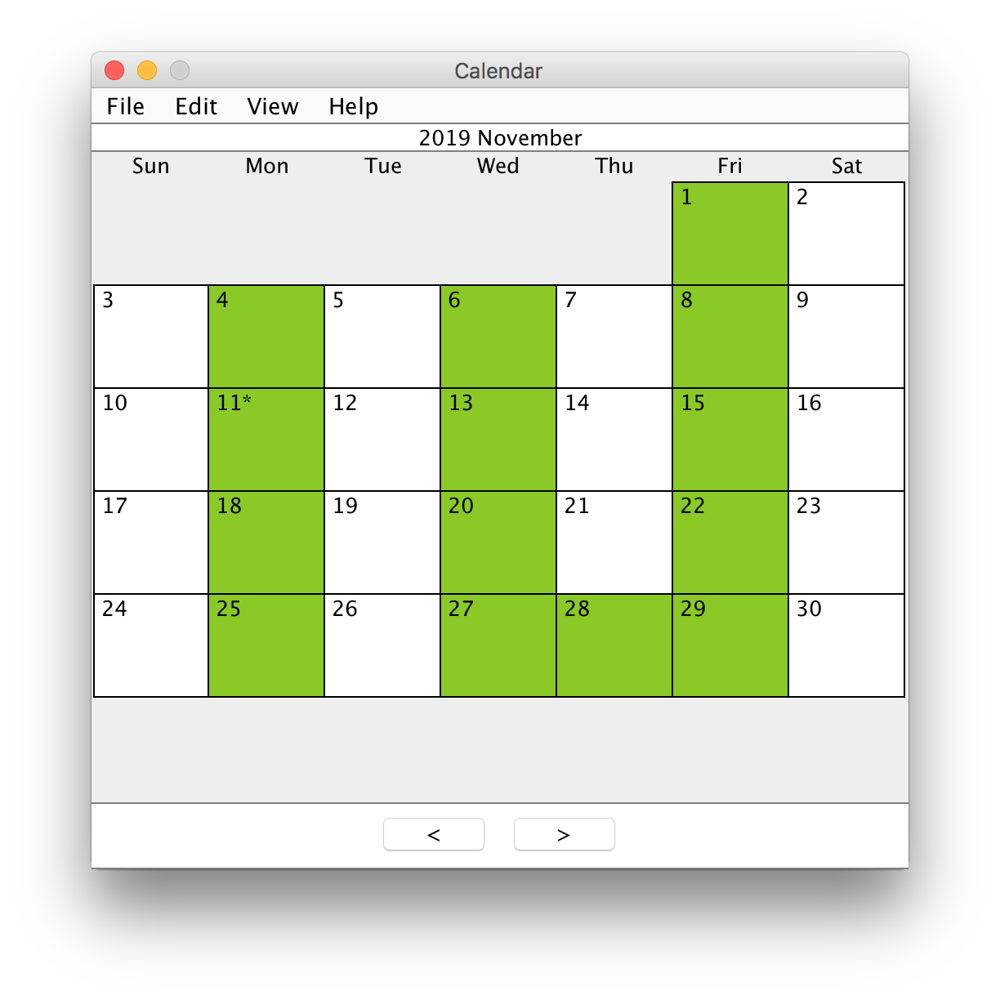

# Calendar App created in Java using Swing

Features:
- A calendar and list display
- Single or repeating event options
- Event creator and editor
- Search for events in range
- Holidays from a [web API](https://date.nager.at/API)
- Saving and loading using [Jackson JSON Library](https://github.com/FasterXML/jackson)
- Changeable settings

[Link to the repository](https://github.com/emtsn/calendar-app).

Created for a course in 3 months (Sept-Nov 2019) with minor updates afterwards.

Updates (May 2020):
- Added ability to merge holidays on the same day
- Added holidays to Calendar display
- Added option to choose save location
- Added ability to save settings between sessions

Updates (June 2020):
- Improved layout of events
- Improved saving and loading options
- Improved settings menu and added more settings
- Updated search algorithm
- Added search functionality